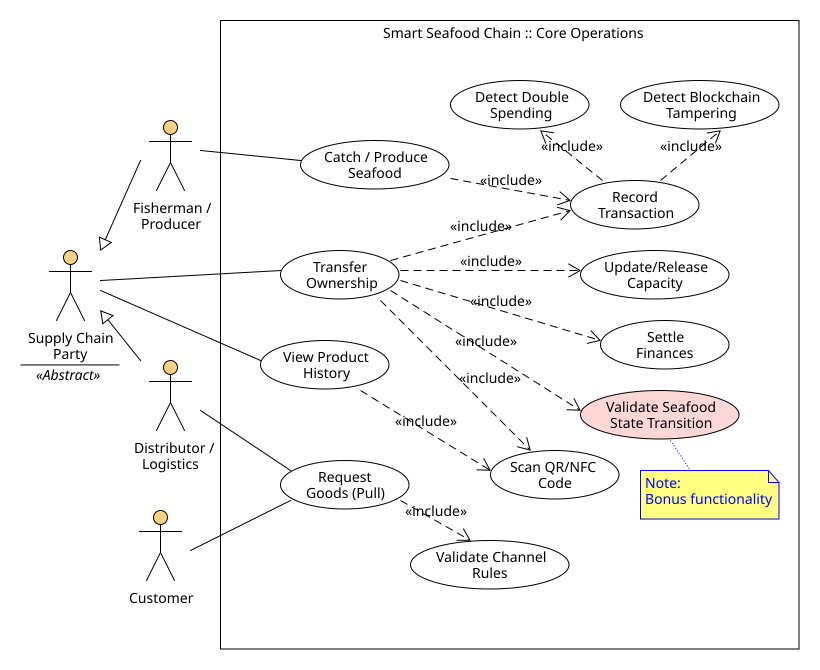
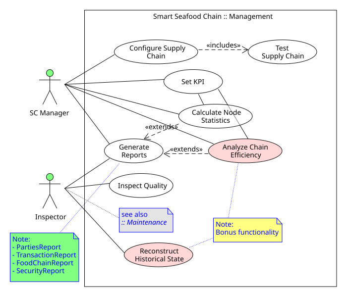
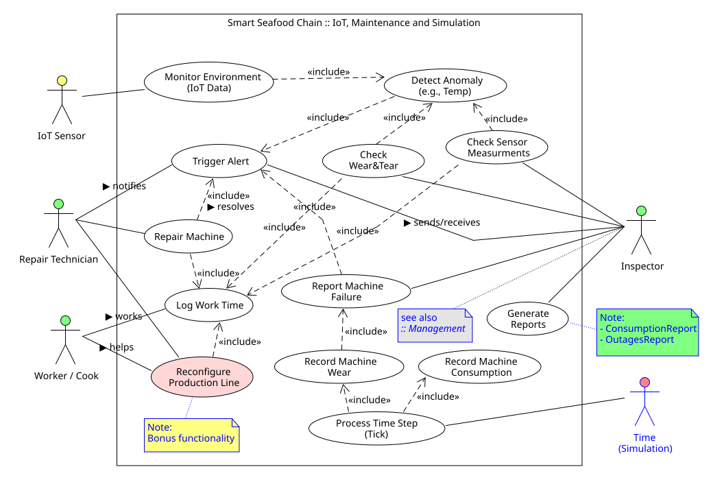
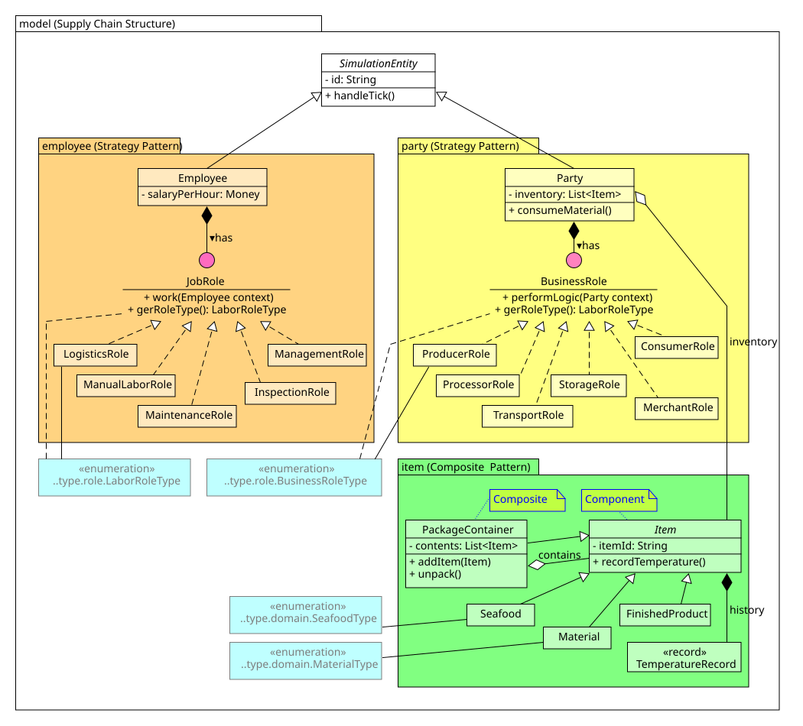
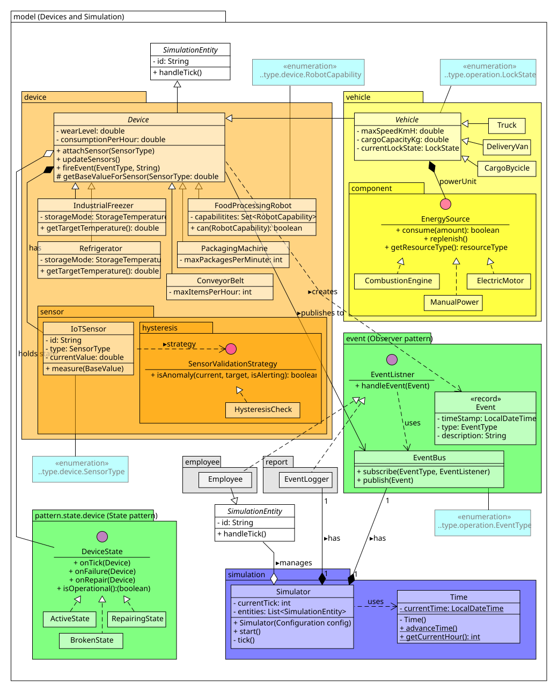
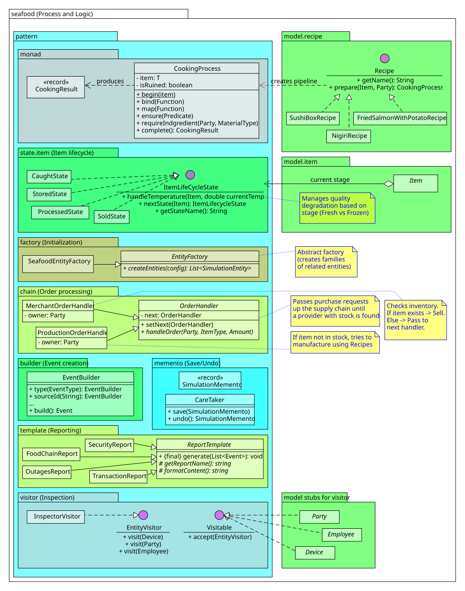
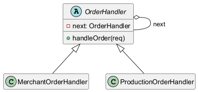

# B6B36OMO — Objektový návrh a modelování, <br>SW2 Smart Seafood Chain, 1. prosince 2025

URL: https://gitlab.fel.cvut.cz/B251_B6B36OMO/zubkovla/-/tree/SW2

## Vysokoúrovňové požadavky (High–level requirements)

### Podnikatelské požadavky (BRQ)

- BRQ1 — Zajistit ***sledování původu mořských plodů v celém logistickém řetězci (LŘ)***.
- BRQ2 — Mít možnost ***plné kontroly LŘ po stránce***:
  - BRQ2.1 — ***ekonomické*** (marže, náklady, efektivita, doby obratů),
  - BRQ2.2 — ***logistické*** (přeprava, výkyvy poptávky, výroba),
  - BRQ2.3 — ***technické*** (stavy strojů, poruchy, údržba).
- BRQ3 — Mít možnost ***auditovat provoz LŘ na základě reportů***.

### Uživatelské požadavky (URQ)

Požadavky vznikají na základě identifikace potřeb a cílů. Při definování uživatelských požadavků se vštěpil pojem uživatelských příběhů (tzv. 'user story' — součást tzv. EPIC v agilní praxi). Uživatelský příběh vzniká v následující podobě: Jako *[role osoby]*, já *[chci]*, *[tak aby]*.

- URQ1 — Jako *Zákazník*, chci ***nakoupit mořské plody v určeném stavu a kvalitě ve stanovené době na určeném místě za určitou cenu***, tak abych ***uspokojil svou potřebu (poptávka)***.
- URQ2 — Jako *Rybář, Zpracovatel, Tržnice, Kuchyně, Distributor, Prodejce* chci ***prodat** úlovek dál*, tak abych ***získal peněžní prostředky***.
- URQ3 — Jako *Přepravce* chci ***předat** úlovek dál*, tak abych ***získal peněžní prostředky***.
- URQ4 — Jako *Rybář, Zpracovatel, Sklad, Tržnice, Kuchyně, Přepravce, Prodejce* chci ***předat** úlovek dál*, tak abych ***uvolnil kapacitu***.
- URQ5 — Jako *Manažer logistického řetězce (MLŘ)*, chci ***plnit business požadavky***, tak aby ***logistický řetězec byl agilní a já získal roční prémii***.
- URQ6 — Jako *Inspektor*, chci ***kontrolovat kvalitu výrobků, detekovat a předbíhat odchylkám v režimu LŘ, detekovat a předbíhat poruchám strojů***, tak aby ***logistický řetězec byl neustále v provozu***.
- URQ7 — Jako *Opravář*, chci ***rychlé upravovat nahlášené poruchy strojů***, tak aby ***logistický řetězec byl neustále v provozu***.
- URQ8 — Jako *Kuchař/Pracovník*, chci ***mít možnost neomezené pracovní aktivity***, tak ***abych byl co nejlépe finančně ohodnocen***.

### Funkční požadavky (FRQ)

V této fázi funkční požadavky jsou formulovány jako sady klíčových schopností systému. Tento přístup upřednostňuje srozumitelnost a kontext před striktní formalizací, která bude doplněna v následných krocích návrhu (v případech užití a detailních funkčních systémových požadavcích).

- **Blokčejn**
  - **FRQ1 (definice)** — systém musí zabezpečit plnou dohledatelnost každé šarže mořských plodů od ulovení až po konečného zákazníka („od lodě do talíře“) prostřednictvím registrace jednoznačného ID šarže a sekvence neměnných blockčejnových transakcí.

  - **FRQ2 (implementace)** — každá operace související s materiálovým tokem v logistickém řetězci (lov, přeprava, zpracování, skladování, vaření, balení, prodej) musí být zaznamenána jako blockčejnová transakce obsahující minimálně: strany, čas, parametry (teplota, kvalita, cena), podpis a hash předchozí transakce. Může být zaznamenán stav, název produktu a jeho složení.

  - **FRQ3 (bezpečnost a integrita)** — systém musí automaticky detekovat a blokovat vícenásobný prodej stejného zboží (double–spending) a jakýkoliv pokus o zpětnou manipulaci s parametry transakcí (například zpětnou změnu zapsané teploty), včetně simulace celých falešných scénářů (blockchain tampering).

  - **FRQ4 (uživatelský přístup)** — zákazník nebo autorizovaný zaměstnanec musí mít možnost naskenovat QR/NFC kód na produktu a zobrazit kompletní odpovídající historii šarže včetně teplotního režimu, aplikovaných procesů, případně změn stavů produktu a odpovědných subjektů a osob.
- **Provoz a logistika**
  - **FRQ5 (ekonomika materiálového toku)** — systém musí evidovat a automaticky vypořádat finance při každém předání šarže a materiálů (cena, marže) a uvolňovat kapacitu skladů/výroby. Iniciativa k inicializace toku může pocházet od zákazníka *("tažení")* či od výrobce *("tlačení")*. V případě nedostatku peněz může být poskytnut obchodní. O jeho výši, době splátek rozhoduje MLŘ (viz. **FRQ11**). 

  - **FRQ6 (třídy produktů, kanály)** — systém musí podporovat více kanálů (např. čerstvé vs. mražené produkty) s vlastními pravidly a účastníky.

  - **FRQ7 (dodržení režimu logistického řetězce, IoT a chlazení)** — systém musí umožňovat připojení IoT senzorů (teplota, vlhkost, otřesy) k přepravním a skladovacím jednotkám a automaticky zaznamenávat a vyhodnocovat dodržování chladícího řetězce v reálném čase.

  - **FRQ8 (reakce na problémy)** — systém musí automaticky upozorňovat příslušné role při detekci anomálií (teplotní odchylka, porucha stroje, případně zpoždění přepravy, překročení kapacity, vloupání atd). Systém může upozorňovat příslušné role přímo, nebo používat k tomu vyhrazenou linku (typ + priorita + FIFO).
- **Řízení a role**
  - **FRQ9 (definuje řídicí role)** — MLŘ a Inspektor musí mít možnost aktivně procházet řetězec po článcích, kontrolovat stav, opotřebení strojů, provádět optimalizace procesů, kontrolovat dodržení kvality výrobků, jejich akce se zapisují to logů.  
  - **FRQ10 (sestavení logistického řetězce)** — systém musí umožňovat MLŘ sestavovat LŘ, to jest skládat články LŘ za sebe podle funkcionality, určovat skladové, výrobní kapacity, objemy a způsoby přepravy, stanovovat bod rozpojení v LŘ (bod ve kterém tažení materiálového toku se mění na tlačení — do tohoto bodu zasahuje aktuální poptávka zákazníka).
  - **FRQ11 (nastavení logistického řetězce, KPI)** — systém musí umožňovat MLŘ provádět nastavení jednotlivých článků řetězce, včetně dob obratů zásob, přepravy a plateb, výše a doby obchodního úvěru, stanovovat KPI pro agilitu řetězce (např. čas od úlovku ke konečnému prodeji < 72 hodin, minimální ztráty < 2 % atd.), stanovovat odměny pracovníků a prémie; nakonec testovat průchod materiálového toku přes LŘ.
  - **FRQ12 (spotřeba pracovní síly a strojů)** — systém musí umožňovat kuchařům/pracovníkům evidovat odpracovaný čas, množství zpracovaných surovin (materiálů), množství zpracovaných/prodaných šarží pro automatický výpočet výkonnostní odměny. Systém musí evidovat spotřebu strojů a umožnit vyčíslit efektivitu logistického článku.
- **Simulace a reportování**
  - **FRQ13 (simulace)** — systém musí běžet jako diskrétní simulace v jednom vlákně v časových taktech (např. 1 takt = 1 hodina), kdy se v každém taktu sekvenčně zpracovávají všechny události a operace (lov, přeprava, zpracování, vaření, prodej, poruchy, opravy atd.) a transakce všech entit.

  - **FRQ14 (poruchy)** — systém musí modelovat poruchy strojů a robotů na základě opotřebení, generovat události poruch (upozornění) a přidělovat omezený počet opravářů (priorita a FIFO).

  - **FRQ15 (reporty)** — systém musí poskytovat přehledy o LŘ v reálném čase v podobě generovaných reportů z pohledu 1) **materiálového toku** — původ, průchod; 2) **zúčastněných stran** — ziskovost, podíly v LŘ, zdržení, použité vybavení, doby obratu zásob (lead–time), vytížení (efektivita); 3) **spotřeby** — peněz a surovin; 4) **bezpečnosti** — pokusy o manipulaci, vícenásobný prodej, krádeže; 5) **transakce** — stav financí, zásob a transakcí za každý takt; 6) **výpadků** — jejich doby a zápisy o opravách.

- **Bonusové požadavky**
  - **FRQ16 (dynamická poptávka) ** — zákazníci mohou vysílat požadavky do kanálů a ostatní strany budou na ně reagovat podle dostupnosti a ceny. Dynamická poptávka může mít sezonní složku a změnu preferenci (chutí) zákazníků.
  - **FRQ17 (stavový automat ryby)** — ryba musí procházet stavy (ulovena → rozpracována → připravena → prodána) s omezením jednoho přechodu mezi stavy za takt.
  - **FRQ18 (rekonstrukce stavu)** — možnost zrekonstruovat přesný stav entity v libovolném minulém taktu na základě přehrání historie blockchainu (Technická realizace: Event Sourcing / Memento).
  - **FRQ19 (report celého logistického řetězce)** — systém umožní stanovit finanční ukazatele logistického článku na základě jeho ziskovosti, kapitálových výdajů na stroje, aktuální spotřeby surovin v článku a vytížení pracovníků. Články se skládají do řetězců a tak lze vyčíslit ziskovost i další ukazatele celého LŘ.
  - **FRQ20 (dynamická změna linek)** — umožnit přeskupení sekvence strojů na lince pro výrobu jiného jídla (např. sushi místo rybího salátu) dle zadaného receptu. Navazuje na dynamickou poptávku **(FRQ16)** nebo adresovat poruchy strojů z důvodů většího opotřebení **(FRQ14).**


### Kvalitativní požadavky a omezení (NFRQ)

- **NFRQ1 (formát konfigurace)** — celý logistický systém (entity, linky, kanály, stroje, počáteční zásoby) musí být konfigurovatelný přes externí YAML soubor.
<div style="page-break-after: always;"></div>

## Diagram případů užití (Use Case Diagram)

Pomůže určit hranice IT systému, co bude systém umožňovat.

### Základní operace

Následující diagram 'Core Operations' zachycuje klíčové procesy toku zboží a financí v celém řetězci. Využíváme zde abstraktního aktéra *Supply Chain Party*, který sjednocuje společné operace všech účastníků, jako je převod vlastnictví nebo náhled historie. Diagram rovněž vizualizuje integraci bezpečnostních kontrol přímo do transakčního procesu


<div style="page-break-after: always;"></div>

### Nastavení řetězce

Diagram 'Management' odděluje strategické řízení od operativy. Role *SC Managera* se zaměřuje na konfiguraci řetězce a vyhodnocování KPI, zatímco role *Inspektora* pokrývá audit kvality a forenzní analýzu historie. Barevným odlišením jsme zvýraznili pokročilé analytické funkce definované jako bonusové požadavky.


<div style="page-break-after: always;"></div>

### Provoz a údržba — monitorování, upozornění, běh simulace

Diagram 'IoT, Maintenance and Simulation' modeluje technickou vrstvu systému, kde klíčový aktér *Time* řídí diskrétní simulaci. Schéma například detailně zobrazuje životní cyklus incidentu od automatické detekce opotřebení senzorem, přes vyvolání upozornění, až po fyzickou opravu technikem a následné uzavření incidentu. Stejný cyklus může vyvolat i *Inspektor*, který svou včasnou kontrolou může předejít havárii a dlouhodobé odstávce výrobní linky. 


<div style="page-break-after: always;"></div>

## Detailní funkční systémové požadavky (SFR, low–level functional requirements)

Tyto požadavky detailně rozpracovávají vysokoúrovňové funkční požadavky (FRQ) a definují konkrétní chování systému v rámci jednotlivých Případů užití. V číslování zde navazujeme na odvozené v UC domény.

### 1. Jádro simulace a čas (Simulation)
*Vychází z Use Case diagramu "IoT & Simulation", aktér Time.*

* **SFR 1.1** — Systém řídí běh aplikace v diskrétních časových krocích (dále jen "takty").
* **SFR 1.2** — Systém umožní konfigurovat délku jednoho taktu v reálném čase (např. 1 takt = 1 hodina) prostřednictvím konfiguračního souboru.
* **SFR 1.3** — V každém taktu systém sekvenčně vyvolá metodu pro zpracování chování (`handleTick`) u všech aktivních entit (Party, Employee, Machine, Sensor).
* **SFR 1.4** — Systém ukončí simulaci po dosažení konfigurovaného maximálního počtu taktů nebo na příkaz uživatele.

### 2. Logistika a Blockchain (Core Operations)
*Vychází z Use Case diagramu "Core Operations", aktér Supply Chain Party.*

* **SFR 2.1 (Transfer)** — Systém provede změnu vlastníka šarže (Batch) z odesílatele na příjemce na základě platného požadavku.
* **SFR 2.2 (Blockchain)** — Při každé změně vlastníka nebo stavu šarže systém vytvoří nový neměnný záznam (Blok) v blockchainu.
* **SFR 2.3 (Security)** — Před zapsáním transakce systém ověří, zda daná šarže již nebyla prodána jinému subjektu (detekce Double Spending).
* **SFR 2.4 (Integrity)** — Systém při každém přístupu k historii šarže ověří validitu hashů v řetězci bloků (detekce Tampering).
* **SFR 2.5 (Finance)** — Systém automaticky převede virtuální peněžní prostředky z účtu kupujícího na účet prodávajícího ve výši dohodnuté ceny.
* **SFR 2.6 (Capacity)** — Systém ověří, zda má příjemce dostatečnou volnou kapacitu skladu před potvrzením transakce.
* **SFR 2.7 (Pull)** — Systém umožní odběrateli (Distributor, Customer) vytvořit poptávku (Request Goods), která se zařadí do seznamu úkolů pro dodavatele.

### 3. Provoz a údržba, Internet věcí (IoT & Maintenance)
*Vychází z Use Case diagramu "IoT & Maintenance", aktéři Sensor, Technician, Worker.*

* **SFR 3.1 (Senzory)** — Systém v každém taktu vygeneruje naměřené hodnoty (teplota, vlhkost) pro každý aktivní senzor připojený k šarži.
* **SFR 3.2 (Wear)** — Systém v každém taktu, kdy je stroj ve stavu `PROCESSING`, zvýší jeho hodnotu opotřebení (Wear Level) o definovanou konstantu.
* **SFR 3.3 (Failure)** — Pokud opotřebení stroje překročí kritickou mez (např. 90 %), systém s definovanou pravděpodobností změní stav stroje na `BROKEN`.
* **SFR 3.4 (Alerts)** — Systém vygeneruje událost typu `Alert`, jakmile dojde k poruše stroje nebo detekci anomálie v datech ze senzoru.
* **SFR 3.5 (Repair)** — Systém umožní přiřadit volného Technika (Repair Technician) k opravě stroje ve stavu `BROKEN`.
* **SFR 3.6 (Repair Time)** — Systém zablokuje Technika a stroj po dobu trvání opravy (konfigurovatelný počet taktů).
* **SFR 3.7 (Reconfig)** — Systém umožní změnit konfiguraci výrobní linky (přiřazení strojů pro jiný recept) pouze pokud je linka ve stavu `IDLE`.
* **SFR 3.8 (Work Log)** — Systém zaznamená každou hodinu práce zaměstnance (Worker, Cook, Technician) do jeho osobního výkazu pro výpočet mzdy.

### 4. Řízení a Reporty (Management)
*Vychází z Use Case diagramu "Management", aktéři SC Manager, Inspector.*

* **SFR 4.1 (Config)** — Systém načte počáteční konfiguraci řetězce (seznam účastníků, strojů, vztahů) z externího souboru formátu YAML při startu aplikace.
* **SFR 4.2 (KPI)** — Systém umožní Manažerovi definovat prahové hodnoty pro KPI (např. maximální doba dodání).
* **SFR 4.3 (Reporting)** — Systém na konci simulace vygeneruje textový soubor `FoodChainReport.txt` obsahující kompletní historii pohybu všech šarží.
* **SFR 4.4 (Reporting)** — Systém vygeneruje soubor `ConsumptionReport.txt` obsahující souhrn spotřeby energie a materiálů pro jednotlivé stroje. A další reporty.
* **SFR 4.5 (Audit – Bonus)** — Systém umožní Inspektorovi vyžádat rekonstrukci stavu konkrétní entity k libovolnému historickému taktu (využitím uložených událostí).
* **SFR 4.6 (Efficiency – Bonus)** — Systém vypočítá celkovou efektivitu řetězce jako poměr mezi celkovými náklady (provoz, odpisy) a celkovými tržbami z prodeje koncovým zákazníkům.

## Diagram tříd (Class Diagram)

### Základní model logistického řetězce (Supply Chain Structure)



### Zařízení, simulace a události (Devices & Simulation Engine)



### Procesy, recepty, reporty (Process & Reporting)



<div style="page-break-after: always;"></div>

## Návrhové vzory (Patterns)

Poznámky k jednotlivým návrhovým vzorům.

### 1\. Observer (Publish-Subscribe)

<div style="float: left; margin: 10px 35px 20px 20px;">  </div>

**Účel:** Zajišťuje komunikaci mezi entitami, ale používá k tomu EventBus.
**Použití:** Třída `EventBus` funguje jako centrální uzel. Zařízení (`Device`) a lidé (`Employee`) publikují události (např. porucha, dokončení směny), na které reagují ostatní komponenty (např. `EventLogger`, `Inspector`).

<div style="clear: both;"></div>

### 2\. Strategy

<div style="float: right; margin: 10px 20px 20px 35px;">  </div>

**Účel:** Umožňuje dynamickou změnu chování objektu kompozicí místo dědičnosti. Navazuje na SOLID, a zejména 'Interface Segregation Principle' v návaznosti na 'Separation of Concerns' a 'Liskov's Substitution Principle'. Třídy by totiž neměli implementovat metody které nepoužívají, proto jejích funkcionalita je jim zapůjčena zvenčí přes zástupnou proceduru. Výhodou je to, že funkcionalitu lze granulárně kombinovat.
**Použití:** Niveluje "kombinatorickou explozi" dědičnosti.

  * `BusinessRole` určuje chování organizace (Rybář vs. Prodejce).
  * `JobRole` určuje práci zaměstnance (Řidič vs. Manažer).
  * `EnergySource` určuje spotřebu vozidla (Spalovací motor vs. Elektro).

<div style="clear: both;"></div>

<div style="page-break-after: always;"></div>

### 3\. Composite

<div style="float: left; margin: 10px 35px 20px 20px;">  </div>

**Účel:** Umožňuje zacházet s jednotlivými objekty a jejich skupinami stejně.
**Použití:** Hierarchie předmětů (`Item`). Třída `PackageContainer` (krabice, paleta) může obsahovat jiné `Item` (ryby nebo další krabice). Metody jako `recordTemperature()` se rekurzivně volají na celý obsah.

<div style="clear: both;"></div>

### 4\. State

<div style="float: right; margin: 10px 20px 20px 35px;">  </div>

**Účel:** Umožňuje objektu měnit chování při změně vnitřního stavu.
**Použití:**

1.  **Device Lifecycle:** `Device` deleguje logiku na stavy `Active`, `Broken`, `Repairing` . Vrací `DeviceState`
2.  **Item Lifecycle:** `Item` mění chování degradace kvality podle stavů `Caught`, `Stored`, `Processed`, `Sold`. Vrací `void`, mění navazuje na další stav uvnitř třídy stavu, dle GoF.

<div style="clear: both;"></div>

<div style="page-break-after: always;"></div>

### 5\. Abstract Factory

<div style="float: left; margin: 10px 35px 20px 20px;">  </div>

**Účel:** Poskytuje rozhraní pro vytváření rodin souvisejících objektů bez specifikace jejich konkrétních tříd.
**Použití:** Třída `SeafoodEntityFactory` zapouzdřuje složitou logiku parsování konfigurace a vytváření propojených objektů (`Party`, `Employee`, `Device`), čímž odděluje `Simulator` od detailů inicializace.

<div style="clear: both;"></div>

### 6\. Builder

<div style="float: right; margin: 10px 20px 20px 35px;">  </div>

**Účel:** Odděluje konstrukci složitého objektu od jeho reprezentace.
**Použití:** V našem případě třída `EventBuilder` slouží k vytváření neměnných (immutable) objektů `Event`. Zajišťuje čitelnost kódu pomoci tzv. plynulého rozhrání (fluent interface) a kaskádovému volání metod (method chaining); validace použitých a povinných polí je prováděná na konci, před vytvořením instance, voláním metody `build()`.

<div style="clear: both;"></div>

Poznámka: potřeba provádět kontrolu 'Object' při přetypování (if instanceOf, zamezení chybám, graceful failure).

<div style="page-break-after: always;"></div>

### 7\. Visitor

<div style="float: left; margin: 10px 35px 20px 20px;">  </div>

**Účel:** Umožňuje přidat nové operace do stávající struktury tříd bez jejich změny.
**Použití:** Role Inspektora (`InspectionRole`). Třída `InspectorVisitor` obsahuje logiku kontroly pro různé typy entit (`Device`, `Party`, `Employee`), aniž by tato logika znečišťovala modely.

<div style="clear: both;"></div>

### 8\. Chain of Responsibility

**Účel:** Předává požadavek řetězcem potenciálních zpracovatelů.
**Použití:** Zpracování poptávky (`OrderHandler`). Pokud obchodník nemá zboží na skladě (`MerchantOrderHandler`), předá požadavek svému dodavateli nebo výrobě (`ProductionOrderHandler`). Implementuje "Pull" logiku řetězce.



<div style="page-break-after: always;"></div>

### 9\. Template Method

<div style="float: left; margin: 10px 35px 20px 20px;">  </div>

**Účel:** Definuje kostru algoritmu v operaci a některé kroky přenechává podtřídám.
**Použití:** Generování reportů (`ReportTemplate`). Metoda `generate()` definuje pevnou strukturu (hlavička → obsah → patička → uložení), zatímco podtřídy (`FoodChainReport`, `SecurityReport`) implementují pouze specifické formátování obsahu.

<div style="clear: both;"></div>

### 10\. Memento

<div style="float: right; margin: 10px 20px 20px 35px;">  </div>

**Účel:** Umožňuje zachytit a externalizovat vnitřní stav objektu, aby mohl být později obnoven.
**Použití:** Třída `SimulationMemento` (implementována jako `record`) ukládá snapshot celého světa simulace v konkrétním taktu. `Caretaker` spravuje historii pro funkci "Time Travel" (rekonstrukce stavu).

<div style="clear: both;"></div>

<div style="page-break-after: always;"></div>

### 11\. Monad (Functional Pattern)

<div style="float: left; margin: 10px 35px 20px 20px;">  </div>

**Účel:** Řetězení operací s automatickým zpracováním vedlejších efektů a chyb (Railway Oriented Programming).
**Použití:** Třída `CookingProcess<T>`. Používá se v receptech (`Recipe`) pro definici výrobního postupu. Pokud jakýkoliv krok selže (např. chybí surovina), zbytek řetězce se přeskočí a vrátí se chybový stav, což eliminuje složité vnořené podmínky `if-else`.

<div style="clear: both;"></div>

Obecně, *monáda* je návrhový vzor, který využívá pojmy z teorie množin a teorie kategorií v matematice, přičemž vychází zejména z konceptu *monoidu*. Monoid je množina, která je uzavřená vzhledem k binární asociativní operaci a obsahuje neutrální prvek. To znamená:

* *Uzavřenost* — operace nad prvky množiny vrací vždy prvek z téže množiny. V kontextu teorie kategorií to umožňuje definovat tzv. *endofunctor* — zobrazení typu na typ uvnitř jedné kategorie. Kategorie je tvořena objekty a morfismy (vztahy) mezi nimi; endofunktor tuto strukturu zachovává.
* *Asociativita* — prvky se spojují po dvou, přičemž na uzávorkování (pořadí provádění operací) nezáleží, záleží však na pořadí prvků: `(AB)C = A(BC) = ABC`. Platí však, že `AB ≠ BA` (komutativita není vyžadována, což je u sekvenčních procesů klíčové; například u vzoru Builder by na pořadí metod záležet nemuselo, u monády ano).
* *Neutrální prvek* — prvek identity, který při operaci s jiným prvkem nemění jeho hodnotu. Například prázdný řetězec `""` pro spojování řetězců, `0` pro sčítání nebo `1` pro násobení.

Monáda zajišťuje chování výpočetních operací tak, že jejich kompozice tvoří monoid.
Zatímco klasický monoid je trojice *(Množina prvků, Asociativní operace, Neutrální prvek)*, monádu lze chápat jako trojici:

1. Funkce vracející *hodnotu* zabalenou v kontejneru/kontextu (uzavřená množina Kleisliho šipek/funkcí).

2. Binární operace spojování funkcí `bind` (v Javě `map` pro čistý prvek nebo `flatmap` pro prvek v kontejneru), 

3. Neutrální operace `return` (v Javě např. `of`), která vrací výsledek zabalený do kotejneru/kontextu. 

    K tomu, aby byla operace skutečně neutrální, musí platit zákony identity:

    1.  *Levá identita* — monáda (jednotka) aplikovaná na funkci vrací stejný výsledek jako samotná funkce; je neutrální.
        - programově: `Return(x).bind(f) == f(x)` 
        - matematický: `return x >>= f ≡ f x`,
    2.  *Pravá identita* — pokud na existující monádu aplikujeme funkci `return` (zabalení do monády), výsledek se nezmění.
        - programově: `m.bind(Return()) == m` 
        - matematický: `m >>= return ≡ m`,

    Toho se docílí správnou aplikaci metody `bind` (`flatMap`). 

V podstatě se jedná o sekvenční „pipeline“, kde každá funkce kromě výpočtu nese i vedlejší efekt (kontext). Při spojování těchto funkcí monáda definuje, jak s tímto kontextem zacházet, aby byla zachována asociativita. Operace `return` pak představuje neutrální funkci/prvek. V rámci monády se obvykle pracuje s tzv. čistými funkcemi (pure functions), zatímco monáda samotná zapouzdřuje a řídí vedlejší efekty. Pokud funkce není čistá, je dobře ji na čistou funkci převést, tj, zajistit aby funkce vracela vedlejší efekt jako součást svého výpočtu. Monáda pak řídí, jak se tyto efekty propagují a kombinují.

Příklad:

```java
// Funkce s vedlějším efektem (vyhození vyjímky)
Integer divide(int a, int b) { return a / b; } // Hrozí ArithmeticException (vedlejší efekt havárie)
```

```java
// Čistá funkce (Pure) - vrací Monádu (Optional)
Optional<Integer> divide(int a, int b) { 
    if (b == 0) return Optional.empty(); // Chyba je nyní hodnotou (kontextem)
    return Optional.of(a / b);
}

// Použití v pipeline (bind/flatMap):
Optional.of(10)
    .flatMap(x -> divide(x, 2)) // OK: Optional[5]
    .flatMap(x -> divide(x, 0)); // OK: Optional.empty (pipeline se bezpečně zastaví)
```

Monáda využívá generický typ (`<T>`), aby vyhovovala definici Endofunktoru — musí být schopna zobrazovat typ na typ uvnitř stejné kategorie (v našem případě kategorie typů v Javě). Konkrétně u nás `CookingProcess<T extends Item>` mapuje různé typy `T` (odvozené od `Item`) na typ `CookingProcess<T>`. Teoreticky bychom mohli použít i širší definici `CookingProcess<T>` (pro libovolný objekt), ale omezení na `Item` nám poskytuje typovou bezpečnost v rámci domény projektu.

*Poznámka: „Monáda je pouze monoid v kategorii endofunktorů“. Na základě osobního pozorování zdrojů na webu, v ruské programátorské praxi se namísto pojmu monáda někdy používá stejný pojem jako v matematice — monoid.*

<div style="page-break-after: always;"></div>

# Slovník pojmů a slovové zkratky

- SCM — Supply chain management.
- *Bod rozpojení* (anglicky *decoupling point* nebo *customer order decoupling point*) — klíčový pojem v logistice a řízení výroby. Označuje místo v logistickém řetězci, kde materiálový tok začne být určen pro konkrétního zákazníka a jeho objednávku. Jinými slovy — místo, kam až dosahuje poptávka konkrétního zákazníka, před toto místo se vyrábí "na sklad". Používá se při řízen zásob. Zákazníci jsou různé a mohou se nacházet podél celého LŘ, a tak i jim příslušné body rozpojení.
- Monad — is a monoid in the category of endofunctors [12]. 

# Reference

1. Nástroj pro tvorby UML, UMLET, URL: https://umlet.com/
2. Nástroj pro psaní v markdown a export do PDF: Typora, v. 1.9, URL: https://typora.io/releases/stable.html
3. Uživatelské příběhy, například: https://www.productplan.com/glossary/user-story
4. OOP staré školy, CS 302, Spring 2008, URL: https://pages.cs.wisc.edu/~hasti/cs302/examples/
5. Monada:
   1. No Nonsense Monad & Functor - The foundation of Functional Programming by César Tron-Lozai, 
      URL: https://www.youtube.com/watch?v=e6tWJD5q8uw
   2. Monad is actually easy. (Conquering the Final Boss of Functional Programming), Coding with Yalco, 
      URL: https://www.youtube.com/watch?v=8hYUthfmSRM
   3. Что значит моноид в программировании? S0ER, URL: https://www.youtube.com/watch?v=Da-avtMWIf8
   4. What is a monad? (Design Pattern), A Byte of Code, URL: https://www.youtube.com/watch?v=VgA4wCaxp-Q
   5. What is a Monad? — Math vs Computer Science, Sheafification of G, URL: https://www.youtube.com/watch?v=roP_HC7tiXw
   6. What is a Comonad? — Comath and Mputer Science, Sheafification of G, URL: https://www.youtube.com/watch?v=T8pjE2JMv-c
   7. Monads in Java, URL: https://www.baeldung.com/java-monads
   8. Functor and monad examples in plain Java, Tomasz Nurkiewicz, 
      URL: https://nurkiewicz.com/2016/06/functor-and-monad-examples-in-plain-java.html
   9. Моноиды и их приложения: моноидальные вычисления в деревьях, URL: https://habr.com/ru/articles/112394/
   10. Моноид без слез, URL: https://sqrtt.pro/monoids-without-tears-ru
   11. Monads, Bartosz Milewski's Programming Cafe, URL: https://bartoszmilewski.com/category/monads/
   12. A Brief, Incomplete, and Mostly Wrong History of Programming Languages, One Div Zero, URL: https://james-iry.blogspot.com/2009/05/brief-incomplete-and-mostly-wrong.html
