# Class Diagram - Smart Seafood Chain

## Hlavní class diagram v Mermaid formátu

```mermaid
classDiagram
    %% Core Simulation
    class SimulationEngine {
        -int currentTick
        -Ecosystem ecosystem
        -EventQueue eventQueue
        -Blockchain blockchain
        +runSimulation()
        +processTick()
        +processEvents()
        +generateReports()
    }

    %% Party Hierarchy
    class Party {
        <<abstract>>
        #String id
        #String name
        #Money balance
        #List~Channel~ channels
        #Wallet wallet
        +sendTransaction(Transaction tx)*
        +receiveTransaction(Transaction tx)*
        +getBalance() Money
        +isInChannel(Channel channel) boolean
        +accept(PartyVisitor visitor)*
    }

    class Fisherman {
        -int catchCapacity
        -String fishingArea
        +catchFish(FishType type, int amount) Fish
        +processTick(int tick)
    }

    class Processor {
        -List~Machine~ machines
        -ProductionLine processingLine
        +processFood(Food food) ProcessedFood
        +handleMachineFailure(Machine machine)
    }

    class Warehouse {
        -Map~Food,Integer~ storage
        -double temperature
        -int capacity
        +storeFood(Food food, int duration)
        +retrieveFood(Food food) Food
        +checkQuality(Food food) boolean
    }

    class Kitchen {
        -List~Chef~ chefs
        -List~RoboticChef~ robots
        -List~Recipe~ recipes
        +cookDish(Recipe recipe, List~Food~ ingredients) Product
        +assignChef(CookingTask task) Chef
    }

    class Distributor {
        -List~Vehicle~ vehicles
        -List~Route~ routes
        +transportGoods(Party from, Party to, List~Food~ goods)
        +optimizeRoute(List~Party~ destinations)
    }

    class Seller {
        -Map~Product,Integer~ inventory
        -Map~Product,Money~ priceList
        +sellProduct(Product product, Customer customer) Transaction
        +updatePrice(Product product, Money price)
    }

    class Customer {
        -List~Demand~ demands
        +createDemand(Product product, int quantity) Demand
        +buyProduct(Product product, Seller seller)
    }

    Party <|-- Fisherman
    Party <|-- Processor
    Party <|-- Warehouse
    Party <|-- Kitchen
    Party <|-- Distributor
    Party <|-- Seller
    Party <|-- Customer

    %% Blockchain Components
    class Blockchain {
        <<singleton>>
        -Map~Channel,List~Block~~ chains
        -List~Transaction~ pendingTransactions
        -static Blockchain instance
        +getInstance() Blockchain
        +addTransaction(Transaction tx, Channel channel)
        +createBlock(Channel channel) Block
        +validateChain(Channel channel) boolean
        +detectDoubleSpending(Product product) boolean
        +detectTampering() List~SecurityIncident~
    }

    class Block {
        -int index
        -long timestamp
        -List~Transaction~ transactions
        -String previousHash
        -String merkleRoot
        -String hash
        +calculateHash() String
        +calculateMerkleRoot() String
        +validate() boolean
    }

    class Transaction {
        -String id
        -Party from
        -Party to
        -Product product
        -OperationType operationType
        -Map~String,Object~ parameters
        -long timestamp
        -String signature
        +sign(Party party)
        +verify() boolean
        +toHash() String
    }

    class Channel {
        -String name
        -ChannelType type
        -List~Party~ participants
        +addParticipant(Party party)
        +isParticipant(Party party) boolean
    }

    class MerkleTree {
        -List~String~ hashes
        +buildTree(List~Transaction~ transactions)
        +getRoot() String
        +verify(Transaction tx) boolean
    }

    Blockchain "1" --> "*" Block
    Block "1" --> "*" Transaction
    Block "1" --> "1" MerkleTree
    Blockchain "1" --> "*" Channel
    Channel "*" --> "*" Party

    %% Food Hierarchy
    class Food {
        <<abstract>>
        #String id
        #FishType type
        #double weight
        #FoodState state
        #long caughtTime
        +getId() String
        +getWeight() double
        +setState(FoodState state)
        +createMemento() FoodMemento
        +restore(FoodMemento memento)
    }

    class Fish {
        -String origin
        -FishermanInfo caughtBy
        +process() ProcessedFood
    }

    class ProcessedFood {
        -List~ProcessingStep~ processingHistory
        -double temperature
        +cook() Product
    }

    class Product {
        -Recipe recipe
        -List~Food~ ingredients
        -PackagingInfo packaging
        +sell() Transaction
    }

    Food <|-- Fish
    Food <|-- ProcessedFood
    Food <|-- Product

    %% State Pattern for Food
    class FoodState {
        <<interface>>
        +transport(Food food)*
        +process(Food food)*
        +store(Food food)*
        +cook(Food food)*
        +sell(Food food)*
    }

    class CaughtState {
        +transport(Food food)
    }

    class TransportedState {
        +process(Food food)
        +store(Food food)
    }

    class ProcessedState {
        +cook(Food food)
        +store(Food food)
    }

    class StoredState {
        +cook(Food food)
        +sell(Food food)
    }

    class CookedState {
        +sell(Food food)
    }

    class SoldState {
    }

    FoodState <|.. CaughtState
    FoodState <|.. TransportedState
    FoodState <|.. ProcessedState
    FoodState <|.. StoredState
    FoodState <|.. CookedState
    FoodState <|.. SoldState
    Food "1" --> "1" FoodState

    %% Machine and Equipment
    class Machine {
        -String id
        -MachineType type
        -double wear
        -double maxWear
        -boolean isBroken
        -double powerConsumption
        +process(Food food) Food
        +increaseWear(double amount)
        +breakDown() AlertEvent
        +repair()
        +accept(InspectorVisitor visitor)
    }

    class Robot {
        -String program
        -boolean isOperational
        +execute(Task task)
    }

    class ProductionLine {
        -List~Machine~ machines
        -Channel channel
        +addMachine(Machine machine)
        +removeMachine(Machine machine)
        +process(Food food) Food
        +reconfigure(List~Machine~ newMachines)
    }

    ProductionLine "1" --> "*" Machine
    Processor "1" --> "1" ProductionLine

    %% Event System (Observer Pattern)
    class EventManager {
        -Map~EventType,List~EventObserver~~ observers
        -EventQueue eventQueue
        +subscribe(EventType type, EventObserver observer)
        +unsubscribe(EventType type, EventObserver observer)
        +publish(Event event)
        +processQueue()
    }

    class Event {
        <<abstract>>
        #String id
        #EventType type
        #long timestamp
        #Party source
        +getType() EventType
        +getTimestamp() long
    }

    class AlertEvent {
        -Machine brokenMachine
        -int priority
        +getMachine() Machine
        +getPriority() int
    }

    class DemandEvent {
        -Product product
        -int quantity
        -Money maxPrice
        +getProduct() Product
        +getQuantity() int
    }

    class CompletionEvent {
        -String taskId
        -String result
        +getTaskId() String
    }

    class EventObserver {
        <<interface>>
        +update(Event event)*
    }

    Event <|-- AlertEvent
    Event <|-- DemandEvent
    Event <|-- CompletionEvent
    EventManager "1" --> "*" Event
    EventManager "1" --> "*" EventObserver
    SimulationEngine "1" --> "1" EventManager

    %% Repair System (Chain of Responsibility)
    class RepairHandler {
        <<abstract>>
        #RepairHandler next
        +setNext(RepairHandler handler) RepairHandler
        +handle(RepairRequest request)*
    }

    class HighPriorityHandler {
        +handle(RepairRequest request)
    }

    class MediumPriorityHandler {
        +handle(RepairRequest request)
    }

    class LowPriorityHandler {
        +handle(RepairRequest request)
    }

    class Repairman {
        -String id
        -boolean isAvailable
        -RepairTask currentTask
        +startRepair(Machine machine, int priority)
        +finishRepair()
        +handleAlert(AlertEvent event)
    }

    RepairHandler <|-- HighPriorityHandler
    RepairHandler <|-- MediumPriorityHandler
    RepairHandler <|-- LowPriorityHandler
    RepairHandler --> RepairHandler : next
    Repairman ..|> EventObserver

    %% Visitor Pattern
    class PartyVisitor {
        <<interface>>
        +visitFisherman(Fisherman f)*
        +visitProcessor(Processor p)*
        +visitWarehouse(Warehouse w)*
        +visitKitchen(Kitchen k)*
        +visitDistributor(Distributor d)*
        +visitSeller(Seller s)*
    }

    class SCMDirector {
        -OptimizationStrategy strategy
        -List~OptimizationAction~ actions
        +visitFisherman(Fisherman f)
        +visitProcessor(Processor p)
        +optimizeTransport(Party from, Party to)
        +adjustMargins(Party party)
        +generateReport() SCMReport
    }

    class Inspector {
        -List~Inspection~ inspectionLog
        +visitProcessor(Processor p)
        +visitWarehouse(Warehouse w)
        +visitKitchen(Kitchen k)
        +checkMachineQuality(Machine m) boolean
        +logInspection(Inspection inspection)
    }

    PartyVisitor <|.. SCMDirector
    PartyVisitor <|.. Inspector

    %% Factory Pattern
    class PartyFactory {
        <<abstract>>
        +createParty(PartyType type, Config config)* Party
    }

    class FishermanFactory {
        +createParty(PartyType type, Config config) Fisherman
    }

    class ProcessorFactory {
        +createParty(PartyType type, Config config) Processor
    }

    class FoodFactory {
        +createFish(FishType type, double weight) Fish
        +createProcessedFood(Fish fish, List~ProcessingStep~ steps) ProcessedFood
        +createProduct(Recipe recipe, List~Food~ ingredients) Product
    }

    PartyFactory <|-- FishermanFactory
    PartyFactory <|-- ProcessorFactory

    %% Builder Pattern
    class TransactionBuilder {
        -Party from
        -Party to
        -Product product
        -OperationType type
        -Map~String,Object~ parameters
        +from(Party from) TransactionBuilder
        +to(Party to) TransactionBuilder
        +product(Product product) TransactionBuilder
        +type(OperationType type) TransactionBuilder
        +addParameter(String key, Object value) TransactionBuilder
        +build() Transaction
    }

    class BlockBuilder {
        -int index
        -List~Transaction~ transactions
        -String previousHash
        +setIndex(int index) BlockBuilder
        +addTransaction(Transaction tx) BlockBuilder
        +setPreviousHash(String hash) BlockBuilder
        +build() Block
    }

    class EcosystemConfigBuilder {
        -List~Party~ parties
        -List~FoodType~ foodTypes
        -List~ProductionLine~ lines
        +addParty(Party party) EcosystemConfigBuilder
        +addFoodType(FoodType type) EcosystemConfigBuilder
        +addProductionLine(ProductionLine line) EcosystemConfigBuilder
        +build() Ecosystem
    }

    %% Memento Pattern
    class FoodMemento {
        -String id
        -FoodState state
        -long timestamp
        -Map~String,Object~ data
        +restore() Food
    }

    class MachineMemento {
        -String id
        -double wear
        -boolean isBroken
        -long timestamp
        +restore() Machine
    }

    class MementoCaretaker {
        -Map~String,List~Memento~~ history
        +save(String entityId, Memento memento, int tick)
        +get(String entityId, int tick) Memento
        +getHistory(String entityId) List~Memento~
    }

    Food ..> FoodMemento : creates
    Machine ..> MachineMemento : creates
    MementoCaretaker "1" --> "*" FoodMemento
    MementoCaretaker "1" --> "*" MachineMemento

    %% Object Pool Pattern
    class ObjectPool~T~ {
        <<abstract>>
        -List~T~ available
        -List~T~ inUse
        +acquire() T
        +release(T object)
        +getAvailableCount() int
    }

    class RepairmanPool {
        +acquire() Repairman
        +release(Repairman repairman)
    }

    class VehiclePool {
        +acquire() Vehicle
        +release(Vehicle vehicle)
    }

    ObjectPool <|-- RepairmanPool
    ObjectPool <|-- VehiclePool

    %% Reporting System
    class ReportGenerator {
        +generateFoodChainReport() FoodChainReport
        +generatePartiesReport() PartiesReport
        +generateFactoryConsumptionReport() FactoryConsumptionReport
        +generateSecurityReport() SecurityReport
        +generateTransactionReport() TransactionReport
        +generateOutagesReport() OutagesReport
    }

    class Report {
        <<abstract>>
        #String fileName
        #long timestamp
        +generate()*
        +saveToFile()*
    }

    class FoodChainReport {
        -Map~String,List~Transaction~~ foodPaths
        +trackProduct(String productId) List~Transaction~
        +generate()
        +saveToFile()
    }

    class SecurityReport {
        -List~SecurityIncident~ incidents
        +addIncident(SecurityIncident incident)
        +generate()
        +saveToFile()
    }

    Report <|-- FoodChainReport
    Report <|-- SecurityReport
    ReportGenerator --> Report

    %% Configuration
    class ConfigurationLoader {
        +loadFromYAML(String filePath) Ecosystem
        +loadFromJSON(String filePath) Ecosystem
    }

    class Ecosystem {
        -List~Party~ parties
        -List~FoodType~ foodTypes
        -List~ProductionLine~ productionLines
        -SCMDirector director
        -Inspector inspector
        -List~Repairman~ repairmen
        +addParty(Party party)
        +getPartyById(String id) Party
        +getAllParties() List~Party~
    }

    ConfigurationLoader ..> Ecosystem : creates
    SimulationEngine "1" --> "1" Ecosystem
    Ecosystem "1" --> "*" Party
```

## Poznámky k diagramu

### Vztahy mezi třídami:
- **Dědičnost** (--|>): Party hierarchie, Food hierarchie, Pattern implementace
- **Implementace interface** (..|>): FoodState implementace, Observer implementace
- **Asociace** (-->): SimulationEngine používá Blockchain, EventManager atd.
- **Kompozice** (1-*): Party obsahuje transakce, Block obsahuje transakce
- **Dependency** (..>): Factory vytváří instance, Builder sestavuje objekty

### Multiplicita:
- 1-1: jeden-k-jednomu (Blockchain singleton)
- 1-*: jeden-k-mnoha (Party má více transakcí)
- *-*: mnoho-k-mnoha (Party může být v mnoha Channel)

### Abstraktní třídy a interface:
- `<<abstract>>`: Party, Food, Event, RepairHandler, Report
- `<<interface>>`: FoodState, EventObserver, PartyVisitor
- `<<singleton>>`: Blockchain, SimulationEngine
