# Design Pattern Diagrams - Smart Seafood Chain

## 1. Factory Method Pattern

### Účel
Vytváření různých typů entit (Party, Food) bez specifikace konkrétní třídy.

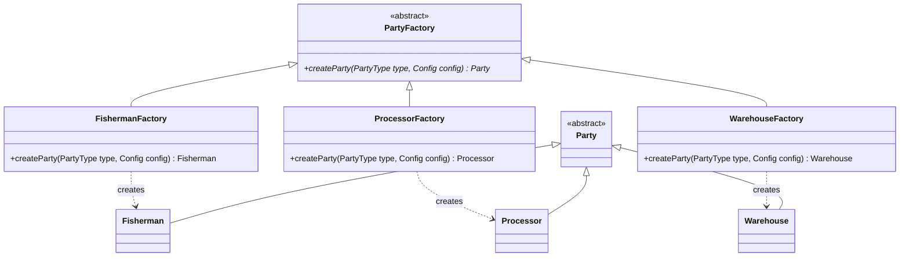

### Použití
```java
PartyFactory factory = new FishermanFactory();
Party fisherman = factory.createParty(PartyType.FISHERMAN, config);
```

---

## 2. Builder Pattern

### Účel
Postupná konstrukce komplexních objektů (Transaction, Block).

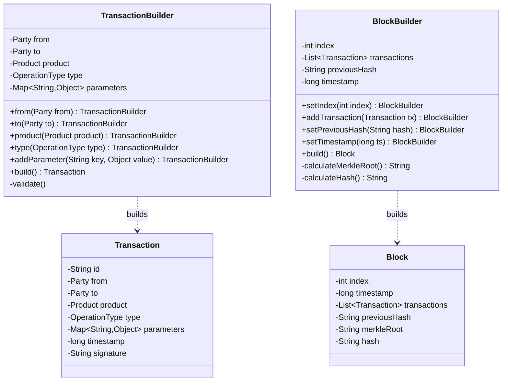

### Použití
```java
Transaction tx = new TransactionBuilder()
    .from(fisherman)
    .to(processor)
    .product(salmon)
    .type(OperationType.TRANSPORT)
    .addParameter("temperature", 4.0)
    .addParameter("duration", 120)
    .build();

Block block = new BlockBuilder()
    .setIndex(5)
    .setPreviousHash(previousBlock.getHash())
    .addTransaction(tx1)
    .addTransaction(tx2)
    .build();
```

---

## 3. State Pattern

### Účel
Řízení stavů ryby v potravinovém řetězci.

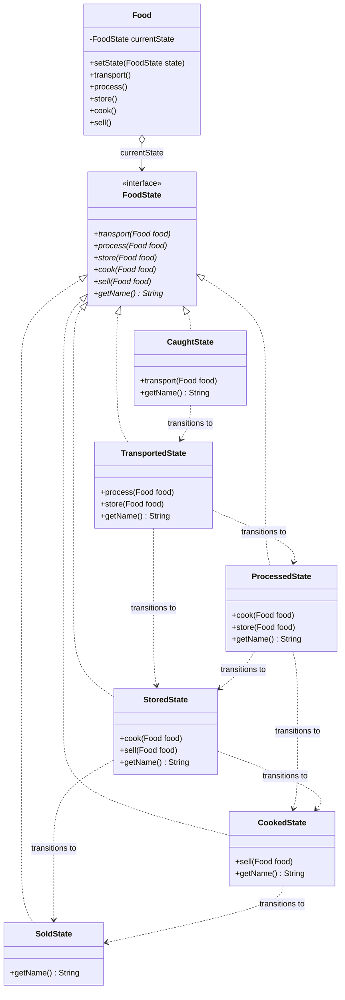

### Sekvenční diagram přechodů
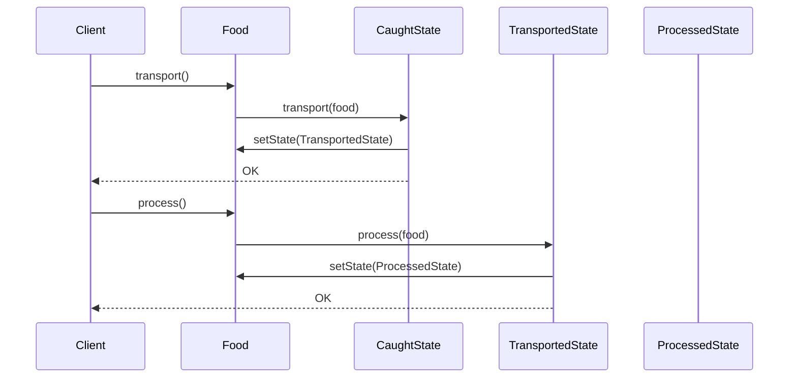

### Použití
```java
Fish salmon = new Fish("S001", FishType.SALMON, 5.0);
salmon.setState(new CaughtState());

salmon.transport(); // přechod do TransportedState
salmon.process();   // přechod do ProcessedState
salmon.cook();      // přechod do CookedState
salmon.sell();      // přechod do SoldState
```

---

## 4. Observer Pattern

### Účel
Event-driven komunikace mezi entitami.

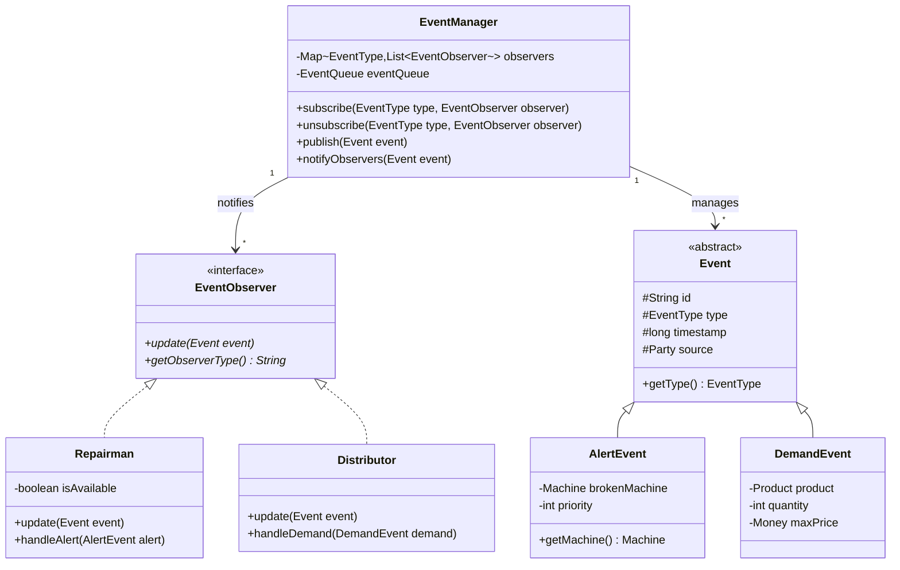

### Sekvenční diagram
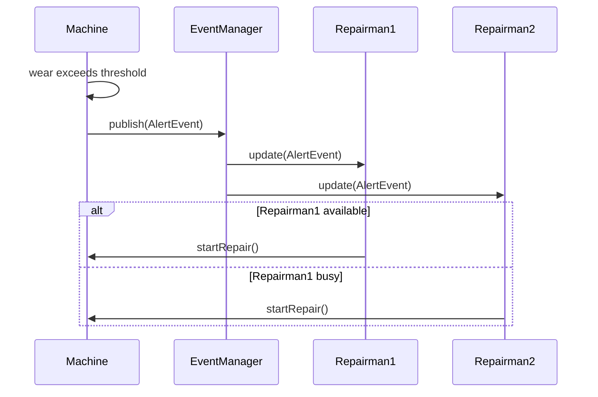

### Použití
```java
EventManager eventManager = new EventManager();

Repairman repairman1 = new Repairman("R1");
Repairman repairman2 = new Repairman("R2");

eventManager.subscribe(EventType.MACHINE_FAILURE, repairman1);
eventManager.subscribe(EventType.MACHINE_FAILURE, repairman2);

// Při poruše stroje
AlertEvent alert = new AlertEvent(brokenMachine, priority);
eventManager.publish(alert); // Notifikuje všechny Repairmany
```

---

## 5. Visitor Pattern

### Účel
Průchod hierarchií entit (SCMDirector, Inspector).

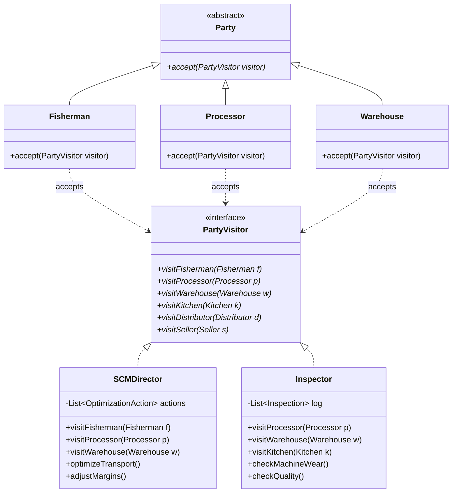

### Sekvenční diagram
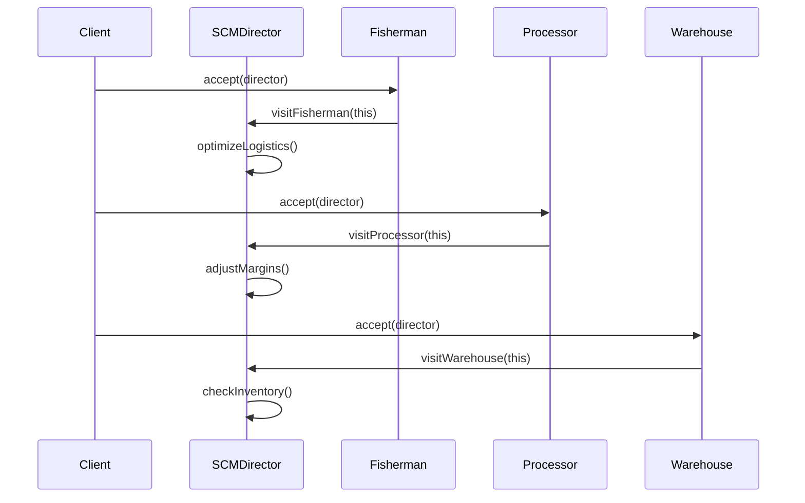

### Použití
```java
SCMDirector director = new SCMDirector();
Inspector inspector = new Inspector();

for (Party party : ecosystem.getAllParties()) {
    party.accept(director);   // Optimalizace
    party.accept(inspector);  // Kontrola kvality
}
```

---

## 6. Chain of Responsibility Pattern

### Účel
Zpracování oprav podle priority.

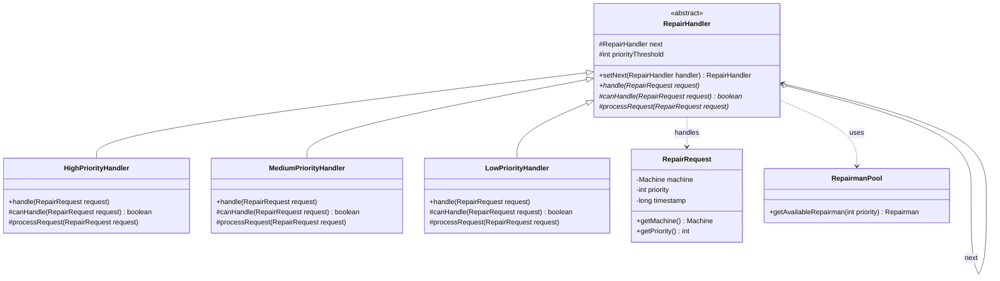

### Sekvenční diagram
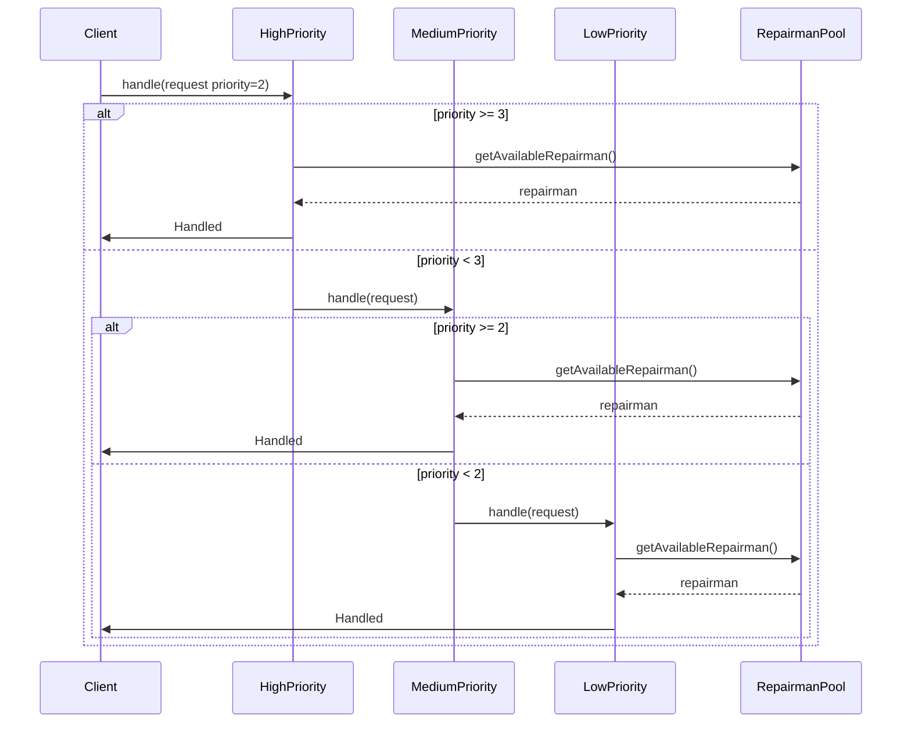

### Použití
```java
RepairHandler chain = new HighPriorityHandler();
chain.setNext(new MediumPriorityHandler())
     .setNext(new LowPriorityHandler());

RepairRequest request = new RepairRequest(brokenMachine, priority);
chain.handle(request); // Zpracuje první vhodný handler
```

---

## 7. Memento Pattern

### Účel
Rekonstrukce stavu entity v minulosti.

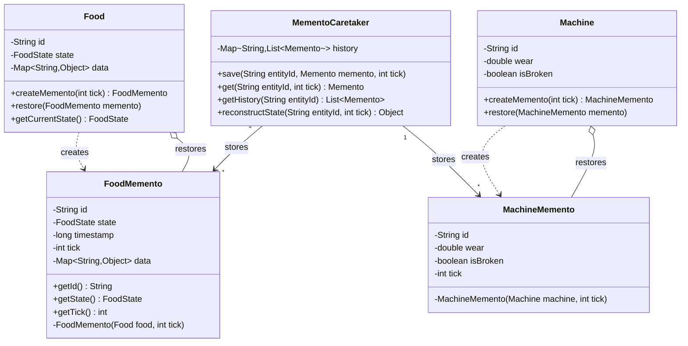

### Sekvenční diagram
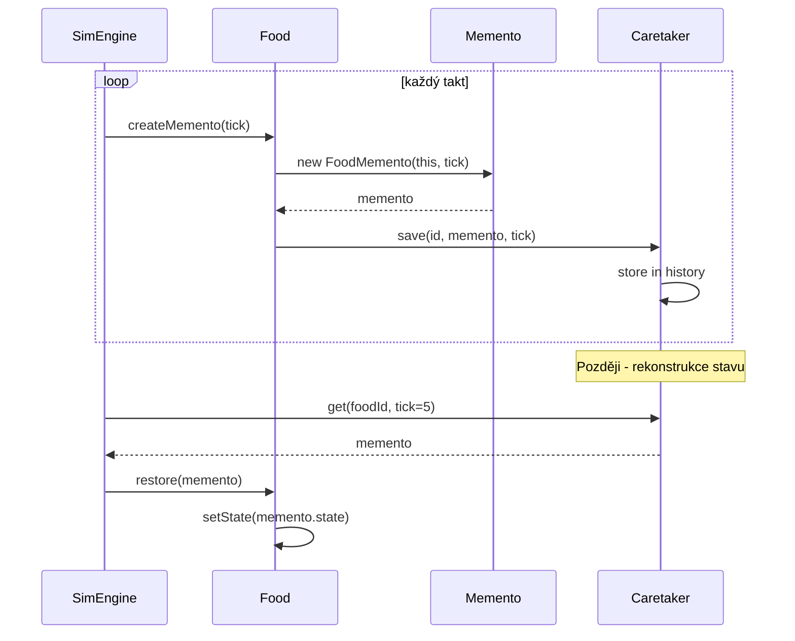

### Použití
```java
MementoCaretaker caretaker = new MementoCaretaker();

// Ukládání stavu každý takt
for (int tick = 0; tick < 10; tick++) {
    FoodMemento memento = fish.createMemento(tick);
    caretaker.save(fish.getId(), memento, tick);
}

// Rekonstrukce stavu v taktu 5
FoodMemento pastState = caretaker.get(fish.getId(), 5);
fish.restore(pastState);
System.out.println("State at tick 5: " + fish.getCurrentState());
```

---

## 8. Singleton Pattern

### Účel
Jediná instance Blockchain a SimulationEngine.

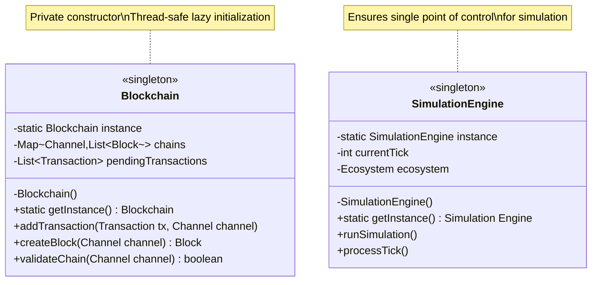

### Použití
```java
// Získání instance
Blockchain blockchain = Blockchain.getInstance();
blockchain.addTransaction(transaction, channel);

SimulationEngine engine = SimulationEngine.getInstance();
engine.runSimulation();

// Nelze vytvořit novou instanci
// Blockchain b = new Blockchain(); // Compilation error!
```

---

## 9. Decorator Pattern

### Účel
Rozšiřování funkcionality strojů.

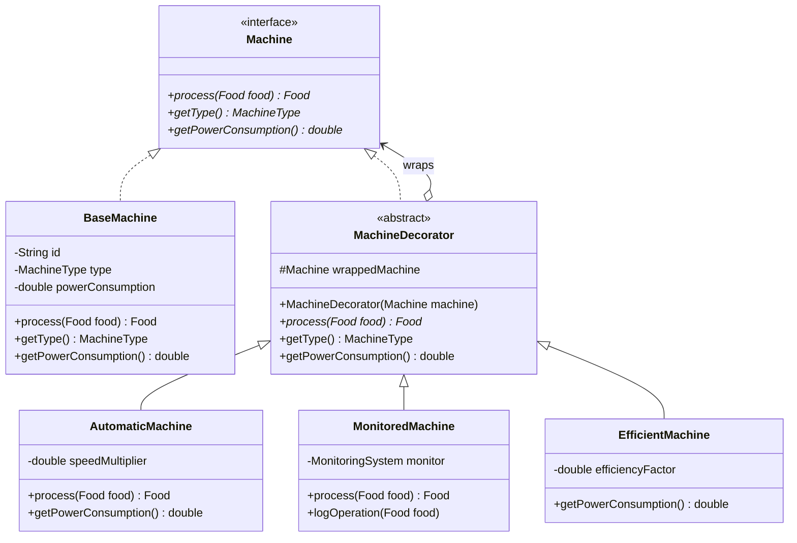

### Použití
```java
// Základní stroj
Machine basicMachine = new BaseMachine("M1", MachineType.FILLETING, 5.0);

// Obalení decoratory
Machine efficientMachine = new EfficientMachine(basicMachine, 0.8);
Machine monitoredMachine = new MonitoredMachine(efficientMachine);
Machine fullyEquipped = new AutomaticMachine(monitoredMachine, 1.5);

// Použití - všechny dekorátory se aplikují
Food processed = fullyEquipped.process(rawFood);
```

---

## 10. Object Pool Pattern

### Účel
Opětovné využití Repairman a Vehicle objektů.

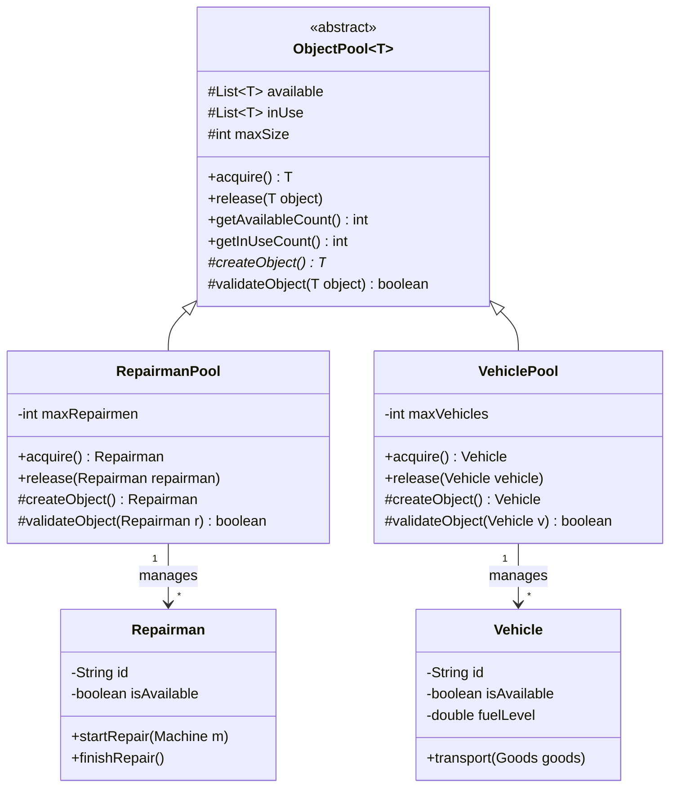

### Sekvenční diagram
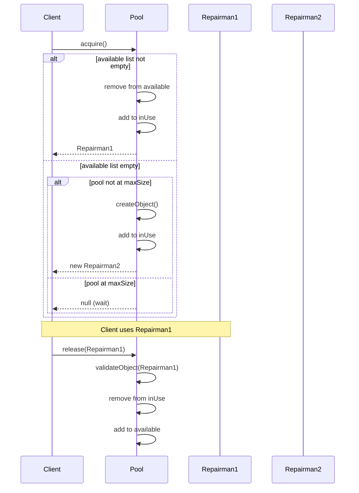

### Použití
```java
RepairmanPool pool = new RepairmanPool(5); // max 5 repairmen

// Získání z poolu
Repairman repairman = pool.acquire();
if (repairman != null) {
    repairman.startRepair(brokenMachine);
    // ... práce ...
    repairman.finishRepair();
    
    // Vrácení do poolu
    pool.release(repairman);
}

// Statistiky
System.out.println("Available: " + pool.getAvailableCount());
System.out.println("In use: " + pool.getInUseCount());
```

---

## 11. Stream API (Functional Programming)

### Použití v projektu

```java
// Filtrování transakcí podle typu
List<Transaction> salesTransactions = blockchain.getAllTransactions()
    .stream()
    .filter(tx -> tx.getType() == OperationType.SALE)
    .filter(tx -> tx.getTimestamp() > startTime)
    .collect(Collectors.toList());

// Agregace spotřeby energie
double totalPowerConsumption = productionLine.getMachines()
    .stream()
    .mapToDouble(Machine::getPowerConsumption)
    .sum();

// Hledání nejdražšího produktu
Optional<Product> mostExpensive = seller.getInventory()
    .keySet()
    .stream()
    .max(Comparator.comparing(seller::getPrice));

// Grouping transakcí podle kanálu
Map<Channel, List<Transaction>> transactionsByChannel = 
    transactions.stream()
        .collect(Collectors.groupingBy(Transaction::getChannel));

// Výpočet průměrné doby opravy
double avgRepairTime = repairLogs.stream()
    .mapToLong(log -> log.getEndTime() - log.getStartTime())
    .average()
    .orElse(0.0);

// Detekce double spending pomocí Stream API
boolean hasDoubleSpending = transactions.stream()
    .collect(Collectors.groupingBy(Transaction::getProductId, Collectors.counting()))
    .values()
    .stream()
    .anyMatch(count -> count > 1);

// Vytvoření reportu pomocí Stream API
String foodChainReport = foodHistory.stream()
    .sorted(Comparator.comparing(Transaction::getTimestamp))
    .map(tx -> String.format("%s: %s -> %s (%s)", 
        tx.getTimestamp(), 
        tx.getFrom().getName(), 
        tx.getTo().getName(),
        tx.getType()))
    .collect(Collectors.joining("\n"));
```

### Výhody použití Stream API:
1. **Deklarativní styl** - co chceme, ne jak to udělat
2. **Čitelnost** - zřetelný tok dat
3. **Kompozice operací** - řetězení operací
4. **Lazy evaluation** - operace se vykonávají až když je potřeba
5. **Paralelizace** - snadné použití `.parallel()`

