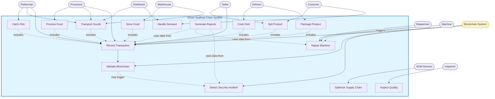

# Use Case Diagram - Smart Seafood Chain

## Hlavní Use Case Diagram

## Detailní Use Cases

### UC1: Catch Fish
**Actor:** Fisherman  
**Popis:** Rybář uloví rybu v určité oblasti a množství  
**Preconditions:** Rybář má dostatečnou kapacitu  
**Postconditions:** Ryba je ulovena a zaznamenána v blockchainu  
**Main Flow:**
1. Rybář iniciuje lov ryb
2. Systém určí typ a množství ulovených ryb
3. Vytvoří se Fish instance se stavem CaughtState
4. Transakce "Fishing" je zapsána do blockchainu
5. Ryba je přidána do inventáře rybáře

**Alternative Flow:**
- Kapacita překročena → zamítnutí akce
- Kvóta vyčerpána → zamítnutí akce

---

### UC2: Transport Goods
**Actor:** Distributor, Fisherman, Processor  
**Popis:** Přeprava potravin mezi stranami řetězce  
**Preconditions:** 
- Odesílatel má zboží v inventáři
- Distributor má dostupné vozidlo
**Postconditions:** 
- Zboží je přemístěno k příjemci
- Transakce zaznamenána v blockchainu
**Main Flow:**
1. Actor iniciuje přepravu (from → to)
2. Systém ověří dostupnost zboží
3. Distributor přiřadí vozidlo
4. Zboží změní stav (např. CaughtState → TransportedState)
5. Vytvoří se Transaction typu TRANSPORT
6. Transaction je zapsána do blockchainu s parametry (teplota, doba)
7. Zboží je přidáno do inventáře příjemce

**Alternative Flow:**
- Vozidlo není dostupné → čekání na uvolnění
- Teplota nekoresponduje → varování o kvalitě

---

### UC3: Process Food
**Actor:** Processor  
**Popis:** Zpracování syrové ryby na filety nebo jiné produkty  
**Preconditions:** 
- Processor má rybu v inventáři
- Stroje jsou funkční
**Postconditions:** 
- Ryba je zpracována
- Transakce zaznamenána
**Main Flow:**
1. Processor iniciuje zpracování
2. Systém přiřadí stroj z ProductionLine
3. Stroj zpracuje rybu (Fish → ProcessedFood)
4. Wear stroje se zvýší
5. Vytvoří se Transaction typu PROCESSING
6. Transaction je zapsána do blockchainu
7. ProcessedFood je přidána do inventáře

**Alternative Flow:**
- Stroj se porouchá → AlertEvent, čekání na opravu
- Materiál chybí → čekání na dodávku

---

### UC4: Store Food
**Actor:** Warehouse  
**Popis:** Skladování potravin při kontrolované teplotě  
**Preconditions:** Sklad má volnou kapacitu  
**Postconditions:** Potravina je uskladněna  
**Main Flow:**
1. Warehouse přijme potravinu
2. Systém zkontroluje kapacitu a teplotu
3. Potravina změní stav na StoredState
4. Vytvoří se Transaction typu STORAGE s parametry (temperature, duration)
5. Transaction je zapsána do blockchainu
6. Potravina je přidána do storage mapy

**Alternative Flow:**
- Kapacita plná → odmítnutí
- Teplota mimo rozsah → varování

---

### UC5: Cook Dish
**Actor:** Kitchen  
**Popis:** Příprava hotových pokrmů z ingrediencí  
**Preconditions:** 
- Kitchen má všechny potřebné ingredience
- Kuchař nebo robot je dostupný
**Postconditions:** Hotový produkt je vytvořen  
**Main Flow:**
1. Kitchen vybere recept
2. Systém zkontroluje dostupnost ingrediencí
3. Přiřadí kuchaře nebo robota
4. Ingredience jsou zpracovány podle receptu
5. Vytvoří se Product instance
6. Potravina změní stav na CookedState
7. Vytvoří se Transaction typu COOKING
8. Transaction je zapsána do blockchainu

---

### UC6: Package Product
**Actor:** Kitchen, Processor  
**Popis:** Zabalení hotového produktu pro prodej  
**Preconditions:** Produkt je připraven  
**Postconditions:** Produkt je zabalen  
**Main Flow:**
1. Actor iniciuje balení
2. Systém přiřadí obalový materiál
3. Vytvoří se PackagingInfo
4. Vytvoří se Transaction typu PACKAGING
5. Transaction je zapsána do blockchainu

---

### UC7: Sell Product
**Actor:** Seller, Customer  
**Popis:** Prodej produktu zákazníkovi  
**Preconditions:** 
- Seller má produkt v inventáři
- Customer má dostatečný balance
**Postconditions:** 
- Produkt je prodán
- Finance převedeny
- Transakce zaznamenána
**Main Flow:**
1. Customer vyžádá produkt
2. Seller ověří dostupnost a cenu
3. Systém ověří balance Customera
4. Vytvoří se Transaction typu SALE
5. Balance se upraví (Customer -=, Seller +=)
6. Produkt změní stav na SoldState
7. Transaction je zapsána do blockchainu
8. Produkt je odebrán z inventáře Sellera

**Alternative Flow:**
- Nedostatečný balance → zamítnutí
- Produkt není dostupný → nabídka alternativy

---

### UC8: Record Transaction
**Actor:** Blockchain System  
**Popis:** Záznam transakce do blockchainu  
**Preconditions:** Transakce je validní  
**Postconditions:** Transakce je zaznamenána v blockchainu  
**Main Flow:**
1. Party iniciuje operaci
2. Vytvoří se Transaction pomocí TransactionBuilder
3. Transaction je podepsána (signature)
4. Systém ověří validitu (from, to, product exist)
5. Transaction je přidána do pendingTransactions
6. V dalším taktu je Transaction začleněna do nového Block
7. Block je přidán do příslušného Channel
8. Merkle root je vypočítán
9. Block hash je vypočítán a spojen s předchozím blokem

---

### UC9: Validate Blockchain
**Actor:** Blockchain System  
**Popis:** Validace integrity blockchainu  
**Preconditions:** Blockchain existuje  
**Postconditions:** Integrita je ověřena nebo je detekována manipulace  
**Main Flow:**
1. Systém prochází všechny bloky v kanálu
2. Pro každý blok:
   - Ověří hash bloku
   - Ověří propojení s previousHash
   - Ověří merkle root
3. Pokud vše souhlasí → blockchain je validní
4. Pokud nesouhlasí → vytvoří SecurityIncident

**Alternative Flow:**
- Hash nesouhlasí → manipulace detekována
- PreviousHash neodpovídá → řetězec přerušen

---

### UC10: Repair Machine
**Actor:** Repairman, Machine  
**Popis:** Oprava porouchaného stroje  
**Trigger:** Machine se porouchá (wear > maxWear)  
**Preconditions:** Stroj je porouchaný  
**Postconditions:** Stroj je funkční  
**Main Flow:**
1. Machine detekuje wear > maxWear
2. Machine vytvoří AlertEvent s prioritou
3. EventManager publikuje AlertEvent
4. Repairman observeři jsou notifikováni
5. Dostupný Repairman přijme úkol
6. RepairHandler chain zpracuje request podle priority
7. Repairman začne opravu (startRepair)
8. Po několika taktech oprava končí (finishRepair)
9. Machine.wear je resetován na 0
10. Machine.isBroken = false
11. Vytvoří se CompletionEvent

**Alternative Flow:**
- Žádný Repairman není dostupný → request čeká v queue (FIFO)
- Vysoká priorita → přednostní zpracování

---

### UC11: Optimize Supply Chain
**Actor:** SCM Director  
**Popis:** Optimalizace logistického řetězce  
**Preconditions:** Ekosystém existuje  
**Postconditions:** Optimalizace provedena  
**Main Flow:**
1. SCMDirector prochází všechny Party (Visitor pattern)
2. Pro každou Party:
   - Kontroluje marže
   - Analyzuje dodací lhůty
   - Identifikuje bottlenecky
3. Provádí optimalizační akce:
   - Upravuje ceny
   - Mění logistické cesty
   - Realokuje zdroje
4. Akce jsou zaznamenány do logu
5. Generuje se SCMReport

---

### UC12: Inspect Quality
**Actor:** Inspector  
**Popis:** Kontrola kvality procesů a zařízení  
**Preconditions:** Ekosystém existuje  
**Postconditions:** Kontrola provedena, log vytvořen  
**Main Flow:**
1. Inspector prochází všechny Party (Visitor pattern)
2. Pro stroje a roboty:
   - Kontroluje úroveň opotřebení
   - Ověřuje kvalitu výstupů
3. Pro sklady:
   - Kontroluje teplotu
   - Ověřuje kvalitu uskladněných potravin
4. Vytváří Inspection záznamy
5. Záznamy jsou přidány do inspectionLog
6. Pokud je problém → vytvoří se varování

---

### UC13: Generate Reports
**Actor:** System, SCM Director, Inspector  
**Popis:** Generování různých typů reportů  
**Preconditions:** Data existují  
**Postconditions:** Reporty jsou uloženy do souborů  
**Main Flow:**
1. ReportGenerator sbírá data z různých zdrojů
2. Vytváří specifické reporty:
   - **FoodChainReport**: sledování cesty produktu
   - **PartiesReport**: přehled entit a jejich metrik
   - **FactoryConsumptionReport**: spotřeba energie a materiálu
   - **SecurityReport**: bezpečnostní incidenty
   - **TransactionReport**: finanční přehled
   - **OutagesReport**: statistiky výpadků
3. Každý report je formátován
4. Report je uložen do textového souboru

---

### UC14: Handle Demand
**Actor:** Customer, Distributor  
**Popis:** Zpracování poptávky po produktech  
**Preconditions:** Customer má poptávku  
**Postconditions:** Poptávka je zpracována  
**Main Flow:**
1. Customer vytvoří Demand (typ produktu, množství, max cena)
2. Vytvoří se DemandEvent
3. EventManager publikuje DemandEvent do příslušného kanálu
4. Parties zaregistrované na kanál jsou notifikovány
5. Parties s dostupným produktem reagují nabídkou
6. Customer vybere nejlepší nabídku
7. Proběhne transakce (UC7)

**Alternative Flow:**
- Žádná Party nemá produkt → poptávka zůstává nevyřízena
- Cena překračuje maximum → odmítnutí

---

### UC15: Detect Security Incident
**Actor:** Blockchain System  
**Popis:** Detekce bezpečnostních incidentů  
**Preconditions:** Blockchain existuje  
**Postconditions:** Incident je zaznamenán  
**Main Flow:**

**Double Spending Detection:**
1. Systém analyzuje transakce
2. Identifikuje Product ID
3. Kontroluje, zda Product ID není použit vícekrát v SALE transakcích
4. Pokud ano → vytvoří SecurityIncident typu DOUBLE_SPENDING
5. Incident je zaznamenán do SecurityReport

**Tampering Detection:**
1. Systém validuje blockchain (UC9)
2. Pro každý Block kontroluje:
   - Shoduje se hash s vypočítaným?
   - Shoduje se previousHash?
   - Shoduje se merkle root?
3. Pokud nesouhlasí → vytvoří SecurityIncident typu TAMPERING
4. Identifikuje modifikovaný blok
5. Incident je zaznamenán do SecurityReport

---

## Actor Descriptions

### Primary Actors

| Actor | Popis | Hlavní Use Cases |
|-------|-------|------------------|
| **Fisherman** | Loví ryby v moři | UC1, UC2, UC8 |
| **Processor** | Zpracovává syrové ryby | UC3, UC2, UC8 |
| **Warehouse** | Skladuje potraviny | UC4, UC2 |
| **Kitchen** | Připravuje hotové pokrmy | UC5, UC6 |
| **Distributor** | Přepravuje zboží | UC2, UC14 |
| **Seller** | Prodává produkty | UC7, UC8 |
| **Customer** | Kupuje produkty | UC7, UC14 |

### Secondary Actors

| Actor | Popis | Hlavní Use Cases |
|-------|-------|------------------|
| **SCM Director** | Optimalizuje supply chain | UC11 |
| **Inspector** | Kontroluje kvalitu | UC12 |
| **Repairman** | Opravuje stroje | UC10 |

### System Actors

| Actor | Popis | Hlavní Use Cases |
|-------|-------|------------------|
| **Machine** | Zpracovávací zařízení | UC10 (trigger) |
| **Blockchain System** | Správa blockchainu | UC8, UC9, UC15 |

---

## Use Case Relationships

### Include
- Všechny operace (UC1-UC7) **include** UC8 (Record Transaction)
- UC8 (Record Transaction) **include** UC9 (Validate Blockchain)

### Extend
- UC9 (Validate Blockchain) **may extend to** UC15 (Detect Security Incident)
- UC10 (Repair Machine) **extends** normální provoz při poruše

### Trigger
- Machine **triggers** UC10 při překročení wear threshold
- Customer **triggers** UC14 při vytvoření poptávky

