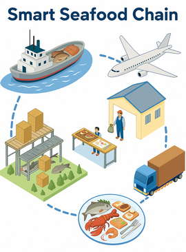

# 🐟 Smart Seafood Chain

Virtuální simulace inteligentního potravinového řetězce pro sledování původu, zpracování a výroby rybích produktů.

---

## 🎯 Popis úlohy

Vytvořte aplikaci, která kombinuje principy **blockchainu** (zajišťuje neměnnost a dohledatelnost dat) a **inteligentní továrny** (simulace výrobních procesů, spotřeby a efektivity). Cílem je vytvořit ekosystém, který sleduje **celý životní cyklus ryby** – od **ulovení** přes **zpracování, skladování, distribuci, výrobu rybích pokrmů** (např. sushi, rybí saláty, mražené polotovary) až po **prodej zákazníkovi**. Každý krok je zaznamenán do blockchainu a současně vyhodnocován z hlediska nákladů, kvality a provozní efektivity.

Součástí aplikace je i předpřipravená konfigurace ekosystému, na které jsou ukázány implementované požadavky.

---

## ⚙ Funkční požadavky

### Povinné

1. **Hlavní entity:**
   - Strany (parties): **rybář**, **zpracovatel**, **sklad**, **kuchyň,** **distributor**, **prodejce / restaurace**, **zákazník**.
   - Objekty: **ryba / mořské plody** (např. losos, treska, kreveta, tuňák, sardinka), **materiál** (např. led, sůl, olej, obal), **hotový produkt** (např. sushi, rybí salát).
   - Zařízení a zaměstnanci: **stroje (např. pásový dopravník)**, **roboti**, **kuchaři,** **opraváři**.
   - Speciální role: **ředitel SCM** (Supply Chain Manager), **inspektor**.
2. **Blockchain vrstva:**

   - Každá operace (lov, převoz, zpracování, skladování, vaření, balení, prodej) je zaznamenána jako **transakce** v blockchainu.
   - Strany, které si předávají výrobky jako zboží, účtují za to peníze. Iniciativa pro předání potravin může v logistickém řetězci vycházet jak od zákazníka (tažení), tak i u výrobce (tlačení).
   - Transakce obsahuje: identifikaci strany, parametry (např. teplota, doba, cena, kvalita), čas a „podpis“ (abstrakce klíče bez šifrování).
   - Transakce jsou propojeny do řetězce (např. pomocí hashů do hashového stromu, tzv. Merkle tree) a není možné je zpětně měnit (detekce manipulace při pokusu o úpravu).
   - Systém realizuje **kanály** pro různé typy (např. kanál pro čerstvé ryby, kanál pro mražené produkty), kde každá strana a transakce má definováno, v jakých kanálech může být účastníkem. 
3. **Diskrétní simulace:**

   - Simulace probíhá v diskrétních **taktech** (časových krocích, např. 1 takt = 1 hodina).
   - V každém taktu mohou probíhat operace jako lov ryb, převoz, skladování, zpracování, vaření, prodej, údržba zařízení.
   - Simulace probíhá v jedné JVM – transakce se aplikují sekvenčně v jednom vlákně.
4. **Komunikace pomocí událostí:**

   - Entitám (lidé, roboti, stroje) jsou zasílány **události** (např. poptávka, porucha, dokončení operace).
   - Události mohou být distribuovány více entitám, které jsou na ně zaregistrovány.
5. **Poruchy a opravy:**

   - Stroje a roboti se po určité době **opotřebují** (opotřebení roste s časem) a mohou se porouchat.
   - Po poruše vzniká událost typu *alert*, která je řešena opravářem (omezený počet opravářů, oprava trvá několik taktů).
   - Opraváři reagují na události typu „porucha zařízení“ podle priority linky a doby vzniku události (FIFO pro stejné priority).
- Generuje události *start* a *finish* opravy. Pokud opraváři nejsou dostupní, čeká se na uvolnění.
6. **Detekce problémů:**
   - **Double spending** – systém detekuje pokus o vícenásobný prodej stejné ryby či produktu (např. pod stejným certifikátem původu). Simulujte na zvoleném scénáři.
   - **Manipulace blockchainu** – systém rozpozná pokus o zpětnou úpravu parametrů transakcí (např. teploty, času skladování). Simulujte na zvoleném scénáři.
7. **Příkladová konfigurace ekosystému:**

   - Alespoň **12 entit** (např. různí rybáři, zpracovatelé, distributoři, kuchaři, roboti, opraváři, 1 ředitel SCM, 1 inspektor).
   - Alespoň **5 druhů potravin** (např. losos, treska, kreveta, tuňák, sardinka).
   - Alespoň **2 výrobní linky** (např. „čerstvé produkty“ a „mražené pokrmy“), každá s posloupností strojů/lidí, která může být dynamicky přeskupena pro výrobu různých jídel (např. sushi vs. mražené filety).
   - Konfigurace může být v kódu nebo načítána z YAML/JSON souboru.
   - Ukažte běh aplikace na této konfiguraci prostřednictvím diskrétní simulace (alespoň 3 takty s transakcemi a událostmi).
8. **Příprava a spotřeba:**

   - Stroje a roboti mají spotřebu (elektřina, materiál), lidé mají náklady na práci.
   - Každá linka generuje report o spotřebě (materiálu, energie) a finančním vyčíslení.
9. **Role ředitele SCM a inspektora:**

   - **Ředitel SCM** prochází ekosystémem podle hierarchie entit (např. od rybáře po prodejce) a provádí akce (např. optimalizace přepravy, kontrola marží a dodacích lhůt - změna nastavení logistického řetězce).
   - **Inspektor** prochází podle míry opotřebení zařízení a kontroluje kvalitu procesů, zapisuje sekvenci akcí do logu.
   - Akce obou rolí se zapisují do událostí a reportů.
10. **Reporty (generované do textových souborů):**

    - **FoodChainReport** – přehled cesty každé ryby od ulovení po prodej, včetně provedených operací a parametrů.
    - **PartiesReport** – přehled entit, jejich marže, časy zdržení a podíl na kanálech.
    - **FactoryConsumptionReport** – přehled spotřeby zařízení, robotů a lidí, včetně finančního vyčíslení a sumární spotřeby za linku.
    - **SecurityReport** – přehled pokusů o manipulaci nebo double spending.
    - **TransactionReport** – stav financí, zásob a transakcí za každý takt.
    - **OutagesReport** – nejdelší, nejkratší a průměrná doba výpadku, průměrná čekací doba na opraváře.

### Bonusové

1. **Dynamická poptávka: **subjekty mohou posílat požadavky do kanálů (např. „Potřebuji 200 kg čerstvého lososa“). Ostatní účastníci mohou reagovat podle dostupnosti a ceny (registrace na typy požadavků).

2. **Stavový automat pro zpracování ryby:** ryba může procházet různými stavy před prodejem: *ulovena → přepravena → zpracována → skladována → vařena / balena → prodána*. Mezi takty simulace je pouze jeden přechod mezi stavy.

3. **Ziskovost a udržitelnost:** sledují se náklady (materiál, energie, práce) a příjmy (prodej). Můžete zohlednit rovněž environmentální faktory (např. ekologický poplatek za rybolov), kvóty apod.

4. **Rekonstrukce stavu:** zrekonstruujte stav ryby nebo zařízení v libovolném taktu na základě historie blockchainu a událostí které byly na nich provedené.

5. **Dynamická změna linek:** umožněte přeskupení sekvence strojů/lidí na výrobní lince pro výrobu různých jídel (např. sushi nebo mražené pokrmy) podle potřeby.

---

## 📐 Nefunkční požadavky

- Není požadována autentizace ani autorizace.
- Aplikace běží v jedné JVM, není nutná distribuovaná implementace ani více vláken.
- Bez grafického rozhraní – komunikace probíhá pomocí příkazové řádky nebo výpisů do souboru.
- Metody a proměnné, které nemají být přístupné ostatním třídám, musí být zapouzdřené.
- Generovaný Javadoc obsahuje co nejméně public metod a proměnných.
- Konfigurace ekosystému může být vytvořena přímo v kódu nebo načítána z externího YAML/JSON souboru (preferováno YAML).

---

## 🧩 Vhodné design patterny

- **Factory / Factory Method**
- **Builder**
- **State**
- **Observer**
- **Visitor**
- **Chain of Responsibility**
- **Memento**
- **Singleton**
- **Decorator**
- **Object Pool**
- **Monáda** (2 body místo 1 za vlastní implementaci)
- **Stream API**

---

## 📚 Doporučená literatura

- [Merkle Tree – GeeksForGeeks](https://www.geeksforgeeks.org/dsa/introduction-to-merkle-tree/)
- [What are Blocks in a Blockchain – TheBlock](https://www.theblock.co/learn/245697/what-are-blocks-in-a-blockchain)

---

## 🐠 Ukázkový běh simulace

**Diskrétní krok 0:**

- Rybář uloví 100 kg lososa → transakce „Fishing“ v kanálu čerstvých ryb.
- Distributor A vyšle požadavek na 50 kg čerstvého lososa.
- Sklad B přijímá zásilku (teplota 4 °C, doba 2 dny) → transakce „Storage“.
- Ředitel SCM optimalizuje přepravu mezi sklady.

**Diskrétní krok 1:**

- Zpracovatel C filetuje rybu → transakce „Processing“.
- Robotický kuchař připravuje sushi → transakce „Cooking“.
- Stroj D se porouchá → alert, opravář přidělen.
- Inspektor kontroluje opotřebení stroje D, zapisuje do logu.

**Diskrétní krok 2:**

- Sushi je zabaleno → transakce „Packaging“.
- Restaurace E prodává → transakce „Sale“.
- Detekován pokus o double spending (E prodává stejný produkt dvakrát).
- Generuje se **FoodChainReport**, **SecurityReport**, **FactoryConsumptionReport**.